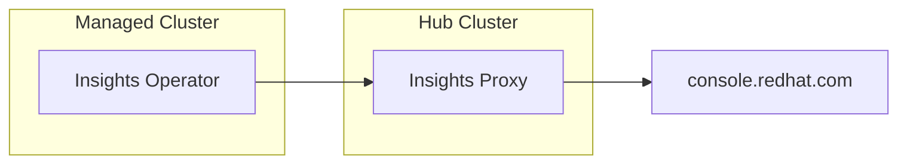

# PoC: Disconnected Insights on ACM

The goal of this PoC is to enable Insights Operator on a disconnected cluster.



This is useful when the managed cluster is disconnected from the internet but
has access to the Hub Cluster.

## Prerequisites

- A Hub Cluster with the ACM operator installed
- A managed cluster (be it local, on AWS, etc.)

All the yaml files are in the `poc` directory.

### Insights Proxy

The first step is to install the Insights Proxy on the Hub Cluster:

```shell
oc import-image insights-proxy/insights-proxy-container-rhel9:1.5.3 --from=registry.redhat.io/insights-proxy/insights-proxy-container-rhel9:1.5.3 --confirm

oc apply -f insights-proxy.yaml
```

You can now check the Insights Proxy on `oc get service/insights-proxy-service -o json | jq -r '.status.loadBalancer.ingress[0].hostname'`:

```shell
curl -s --proxy "http://$(oc get service/insights-proxy-service -o json | jq -r '.status.loadBalancer.ingress[0].hostname'):80" https://console.redhat.com/api/insights-results-aggregator/v2/info | jq
```

### Insights Operator

Now you can jump to your managed cluster and configure the IO to use the proxy. You need to patch the clusterversion/version object:

```shell
oc patch clusterversion/version --type merge -p '{"spec":{"capabilities":{"additionalEnabledCapabilities":["openshift-samples","marketplace","Console","MachineAPI","ImageRegistry","DeploymentConfig","Build","OperatorLifecycleManager","Ingress", "Insights"]}}}'
```

And then configure the Insights Operator to use the Insights Proxy
(`oc apply -f io-config.yaml`). Please update this file httpsProxy key with the result of

```
echo "http://$(oc get service/insights-proxy-service -o json | jq -r '.status.loadBalancer.ingress[0].hostname'):80"
```

Then, restart the operator in order to force
a new data gathering with the latest configuration:

```shell
oc delete pod/$(oc get pods | grep insights-operator | cut -d' ' -f1)
```

#### Optional: disconnected pod

In order to check that this solution would work on a disconnected cluster,
you can create a network policy to block all the internet access except for
the Insights Proxy URL (IPs).

1. List the IPs of the Insights Proxy:
```
dig +short ad2f2703e38c64ddf933371a8885293b-1014996582.us-east-1.elb.amazonaws.com
```
2. Create a network policy. Replace the IPs with yours: `oc apply -f io-network-policy.yaml`.
3. Check that the Insights Operator is not able to connect to the internet:
```
> oc rsh $(oc get pods | grep insights-operator | cut -d' ' -f1)
$ curl -s https://console.redhat.com/api/insights-results-aggregator/v2/info | jq
```
this should timeout.
4. Then, restart the operator:
```
oc delete pod/$(oc get pods | grep insights-operator | cut -d' ' -f1)
```
5. And check the logs:
```
I0626 07:12:29.838899 1 observer_polling.go:159] Starting file observer
W0626 07:12:54.843969 1 builder.go:266] unable to get owner reference (falling back to namespace): Get "https://10.217.4.1:443/api/v1/namespaces/openshift-insights/pods/insights-operator-5db75bbd5f-cbrz5": dial tcp 10.217.4.1:443: i/o timeout
E0626 07:13:20.106306 1 start.go:245] error initializing delegating authentication: unable to load configmap based request-header-client-ca-file: Get "https://10.217.4.1:443/api/v1/namespaces/kube-system/configmaps/extension-apiserver-authentication": dial tcp 10.217.4.1:443: i/o timeout
```
This means that the own cluster IPs are blocked, so you may need to add them to the network policy and restart the operator again.

You may need to add more IPs to the network policy:
```
❯   oc get endpoints kubernetes -n default
NAME         ENDPOINTS             AGE
kubernetes   192.168.126.11:6443   101d
❯ oc get svc kubernetes -n default
NAME         TYPE        CLUSTER-IP   EXTERNAL-IP   PORT(S)   AGE
kubernetes   ClusterIP   10.217.4.1   <none>        443/TCP   101d
```
I've replace the latter with `10.217.0.0/16` and the former with `192.168.126.11/32`.
6. Apply the new network policy and restart the operator again.
7. Check the logs:
```
❯ oc logs --all-containers -f pod/$(oc get pods | grep insights-operator | cut -d' ' -f1) | grep "Successfully reported"
```
