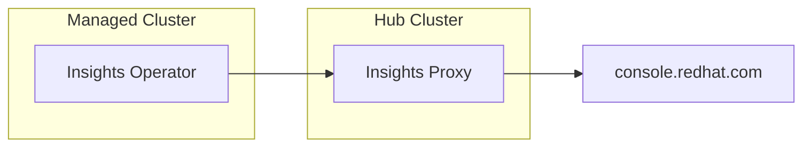

# Disconnected Insights on ACM

The goal of this PoC is to enable Insights Operator on a disconnected cluster.



This is useful when the managed cluster is disconnected from the internet but
has access to the Hub Cluster.

## Prerequisites

- A Hub Cluster with the ACM operator installed
- A managed cluster (be it local, on AWS, etc.)

### Insights Proxy

The first step is to install the Insights Proxy on the Hub Cluster:

```
oc import-image insights-proxy/insights-proxy-container-rhel9:1.5.3 --from=registry.redhat.io/insights-proxy/insights-proxy-container-rhel9:1.5.3 --confirm

oc apply -f insights-proxy.yaml
```

You can now check the Insights Proxy route:

```
curl --proxy https://insights-proxy-...:443 https://console.redhat.com/api/insights-results-aggregator/v2/info
```

### Insights Operator

In order to enable the Insights Operator, you need to patch the clusterversion/version object:

```
oc patch clusterversion/version --type merge -p '{"spec":{"capabilities":{"additionalEnabledCapabilities":["openshift-samples","marketplace","Console","MachineAPI","ImageRegistry","DeploymentConfig","Build","OperatorLifecycleManager","Ingress", "Insights"]}}}'
```

And then configure the Insights Operator to use the Insights Proxy
(`oc apply -f io-config.yaml`). Then, restart the operator in order to force
a new data gathering with the latest configuration:

```
oc delete pod/$(oc get pods | grep insights-operator | cut -d' ' -f1)
```
